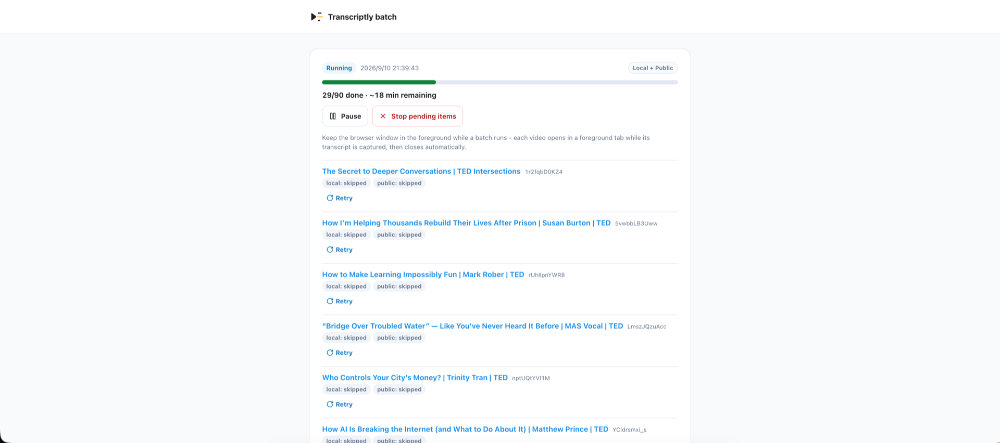

# Transcriptly

[English](README.md) | 简体中文

[Transcriptly](https://transcriptly.libmap.cn) 是一款免费开源的 YouTube 字幕
下载工具。Chrome 扩展可以把任意 YouTube 视频的字幕捕获为带时间戳的
Markdown —— 既可以逐个保存单个视频，也可以批量抓取整个播放列表或频道 ——
所有内容都以纯文本文件的形式保存在你自己的电脑上。你还可以选择将副本发布
到公共字幕档案库。

[](https://chromewebstore.google.com/detail/transcriptly/jkopejjjgdkkacabdhgdlploehikphai)
[](https://transcriptly.libmap.cn)

## 产品截图

**捕获单个视频** —— 在弹窗中预览字幕，保存为带时间戳的 Markdown，可存到
本地，也可发布到公共档案库。


**批量处理流程** —— 在频道或播放列表页选择视频，配置批量任务，然后开始
捕获。

<video src="https://github.com/user-attachments/assets/43da863d-c8e5-4623-9441-42a7c6e45c27" controls width="100%"></video>

**批量管理器** —— 批量任务在后台运行时，可以随时查看进度、暂停或重试
单个视频。



## 为什么选择 Transcriptly

- **文件归你所有。** 捕获结果以普通的 `.md` 文件保存在你指定的文件夹里 ——
  无需注册账号，也不会上传。你可以用 `grep` 搜索、用 `git` 管理版本、在
  Obsidian 或 VS Code 里阅读，或喂给任何能读文本的工具。
- **时间戳始终可用。** Timeline（时间线）格式在每段前保留 `[mm:ss]` 锚点，
  每行文字都能指回视频中的对应时刻。Article（文章）格式则把同样的字幕
  重新排版为流畅的纯文本文章。
- **批量是默认能力。** 在播放列表或频道页勾选想要的视频，批量管理器就会
  在后台逐个处理 —— 支持暂停、继续和重试。每个视频都会生成独立的
  Markdown 文件。
- **发布是一种选择，而不是副作用。** 把捕获内容贡献到公共档案库是一个
  独立、明确的保存目标：登录、确认一次，之后随时可以管理或撤回你的
  贡献。浏览和搜索档案库完全免费，无需账号。

## 工作原理

1. **捕获** —— 打开一个带字幕的 YouTube 视频，点击 Transcriptly 图标，
   预览内容后保存。
2. **存储** —— 字幕通过 File System Access API 写入你指定文件夹中的本地
   Markdown 文件。
3. **检索** —— 你的字幕库就是纯文本：用你已有的工具即可搜索。
4. **发布（可选）** —— 保存前切换到 *Public archive*（公共档案库），即可
   在 [transcriptly.libmap.cn](https://transcriptly.libmap.cn) 分享一份副本，
   生成可搜索、注明出处、并回链 YouTube 的字幕页面。

对于播放列表和频道，直接在列表页勾选视频，剩下的交给批量管理器。

## 安装

### Chrome 扩展

- 从 [Chrome 应用商店](https://chromewebstore.google.com/detail/transcriptly/jkopejjjgdkkacabdhgdlploehikphai)
  安装（推荐），或
- 从 [GitHub Releases](https://github.com/liujiaqi222/transcriptly/releases)
  下载 `*-chrome-sideload.zip`，解压后通过 `chrome://extensions` →
  *加载已解压的扩展程序* 加载该文件夹。

### 公共档案库

无需安装 —— 直接访问
[transcriptly.libmap.cn](https://transcriptly.libmap.cn) 浏览和搜索。只有在
想发布捕获内容或管理自己的贡献时才需要登录。

## 从源码运行

环境要求：**Node.js ≥ 20** 和 **pnpm ≥ 11**（`corepack enable` 即可）。

```sh
pnpm install
```

### 仅扩展（本地捕获）

扩展不依赖网站即可工作 —— 本地 Markdown 保存不需要服务器。

```sh
pnpm dev:extension
```

WXT 会启动开发服务器并打印一个 "Load unpacked" 路径，在 Chrome 的
`chrome://extensions` 中加载即可。生产构建命令是 `pnpm --filter
@transcriptly/extension build`（或用 `pnpm release` 生成经过校验的商店 /
侧载 ZIP 包）。

### 全栈（扩展 + 网站）

网站是一个 Next.js 应用，使用 PostgreSQL（登录、私有字幕库、公共档案库）。

```sh
cp .env.example .env            # 按下表填写各项配置
pnpm cloud:up                   # 启动 postgres + 迁移 + 应用（:3000 端口）
pnpm dev:web                    # 启动 :3000 端口的热重载开发服务器
```

`.env` 需要以下配置：

| 变量 | 说明 |
| --- | --- |
| `DATABASE_URL` | Postgres 连接串（compose 默认值可直接使用） |
| `BETTER_AUTH_SECRET` | `openssl rand -base64 32` |
| `BETTER_AUTH_URL` | 本地开发填 `http://localhost:3000` |
| `GOOGLE_CLIENT_ID` / `GOOGLE_CLIENT_SECRET` | OAuth 回调：`http://localhost:3000/api/auth/callback/google` |
| `GITHUB_CLIENT_ID` / `GITHUB_CLIENT_SECRET` | OAuth 回调：`http://localhost:3000/api/auth/callback/github` |
| `EXTENSION_ORIGINS` | 允许调用登录接口的 `chrome-extension://` 来源（逗号分隔）；默认的固定开发 ID 可配合仓库内的扩展 key 使用 |

在 `localhost:3000` 登录后，再在扩展内点击 *Sign in* 共享网站会话 ——
之后 *Public archive* 就会成为可用的保存目标。

### 常用命令

| 命令 | 作用 |
| --- | --- |
| `pnpm dev:extension` | 扩展开发构建（HMR 热更新） |
| `pnpm dev:web` | 网站开发服务器 |
| `pnpm cloud:up` / `cloud:down` | 通过 Docker Compose 启停 Postgres + 迁移 + 应用 |
| `pnpm test` | 单元测试（所有包） |
| `pnpm e2e` | 扩展端到端测试（Playwright） |
| `pnpm lint` / `pnpm typecheck` | Biome 代码检查 / TypeScript 类型检查 |
| `pnpm release` | 构建并校验商店 / 侧载 ZIP 包 |
| `pnpm db:generate` / `db:migrate` | Drizzle 数据库结构迁移 |

## 仓库结构

```
packages/schema    捕获类型契约（唯一事实来源）
packages/capture   环境无关的捕获核心 + Markdown 序列化器
apps/extension     WXT 扩展：弹窗、内容脚本、批量管理器、
                   云端队列、商店上架素材（store-assets/）
apps/web           Next.js 网站：登录、私有字幕库、公共档案库
docs/adr           架构决策记录
```

## 隐私

本地捕获的内容永远不会离开你的电脑。只有在明确确认加入之后才会公开发布，
且随时可以在 My Contributions（我的贡献）中撤回。详见
[隐私政策](https://transcriptly.libmap.cn/privacy)。

## 许可证

基于 [MIT License](LICENSE) 发布。
